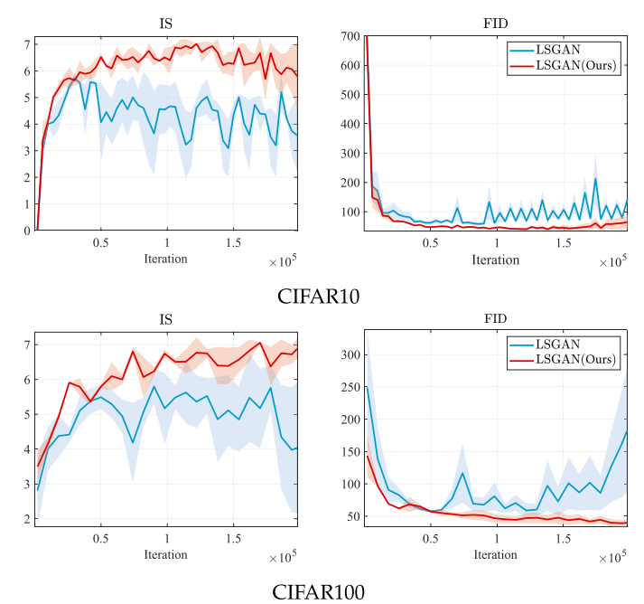

# [TPAMI 2024] Learning with Constraint Learning: New Perspective, Solution Strategy and Various Applications [[Paper]](https://ieeexplore.ieee.org/abstract/document/10430445/)
<h4 align="center">Risheng Liu<sup>1,2</sup>, Jiaxin Gao<sup>1</sup>, Xuan Liu<sup>1</sup>, Xin Fan<sup>1</sup></h4>
<h4 align="center">1. Dalian University of Technology,</h4>
<h4 align="center">2. Peng Cheng Laboratory</h4>


## Pipeline


## Dependencies
```
pip install -r requirements.txt
````

## Download the raw training and evaluation datasets
### Paired datasets 
LOL dataset: Chen Wei, Wenjing Wang, Wenhan Yang, and Jiaying Liu. "Deep Retinex Decomposition for Low-Light Enhancement". BMVC, 2018. [[Baiduyun (extracted code: sdd0)]](https://pan.baidu.com/s/1spt0kYU3OqsQSND-be4UaA) [[Google Drive]](https://drive.google.com/file/d/18bs_mAREhLipaM2qvhxs7u7ff2VSHet2/view?usp=sharing)

LSRW dataset: Jiang Hai, Zhu Xuan, Ren Yang, Yutong Hao, Fengzhu Zou, Fang Lin, and Songchen Han. "R2RNet: Low-light Image Enhancement via Real-low to Real-normal Network". Journal of Visual Communication and Image Representation, 2023. [[Baiduyun (extracted code: wmrr)]](https://pan.baidu.com/s/1XHWQAS0ZNrnCyZ-bq7MKvA)

### Unpaired datasets 
Please refer to [[Project Page of RetinexNet]](https://daooshee.github.io/BMVC2018website/).

## Pre-trained Models 
You can download our pre-trained model from [[Google Drive]](https://drive.google.com/drive/folders/1m3t15rWw76IDDWJ0exLOe5P0uEnjk3zl?usp=drive_link) and [[Baidu Yun (extracted code:cjzk)]](https://pan.baidu.com/s/1fPLVgnZbdY1n75Flq54bMQ)

### Usage

You can run the python file for different applications following the script below:

```
Python Few_shot.py  # For few shot classification tasks.
Python  Data_hyper_cleaning.py  # For data hyper-cleaning tasks.
Python  Numerical.py  # For the non-convex numerical examples.
```

## Visual comparison
1. Numerical mechanism evaluation:
<p align="center">
    
    
</p>
2. Comparison of training efficiency results measured by FID and IS on CIFAR10 dataset (listed top) and CIFAR100 datasets (listed bottom):
<p align="center">
    
</p>

## Citation
If you use this code or ideas from the paper for your research, please cite our paper:
```
@article{liu2024learning,
  title={Learning with Constraint Learning: New Perspective, Solution Strategy and Various Applications},
  author={Liu, Risheng and Gao, Jiaxin and Liu, Xuan and Fan, Xin},
  journal={IEEE Transactions on Pattern Analysis and Machine Intelligence},
  volume={46},
  number={7},
  pages={5026--5043},
  year={2024},
  publisher={IEEE}

}

@article{liu2021investigating,
  title={Investigating bi-level optimization for learning and vision from a unified perspective: A survey and beyond},
  author={Liu, Risheng and Gao, Jiaxin and Zhang, Jin and Meng, Deyu and Lin, Zhouchen},
  journal={IEEE Transactions on Pattern Analysis and Machine Intelligence},
  volume={44},
  number={12},
  pages={10045--10067},
  year={2021},
  publisher={IEEE}
}
```

## Acknowledgement
Part of the code is adapted from previous works: [IAPTT-GM](https://github.com/vis-opt-group/IAPTT-GM), [L2F](https://github.com/baiksung/L2F) and [BLO](https://github.com/vis-opt-group/BLO). We thank the authors for sharing the codes for their great works.

If you have any questions, feel free to contact Jiaxin Gao at jiaxinn.gao@outlook.com.

